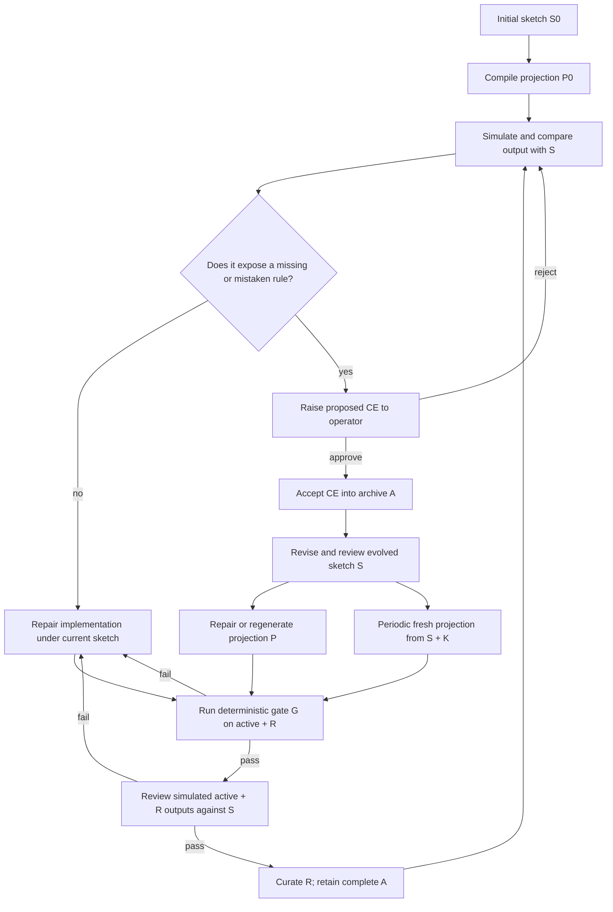

# Agentic Synthesis against Counterexample-Supplemented Sketches

Coding agents can fix an example without learning the rule that made it fail. CESS carries that
rule into the sketch, the next generated implementation, and the checks that protect later
repairs.

Start with a sketch `S`: the user's current specification, including strategy, interfaces, known
rules, and open holes. Generate a replaceable projection `P` from `S` and the repository anchors
`K`. The projection may include code, prompts, and configuration.

Exercise `P` in simulation. A capable model and/or user compares its output with `S`. If the
output violates a rule already in `S`, repair `P` without changing policy. If the failure exposes
a missing or mistaken rule, approve it as a counterexample, record it in archive `A`, revise `S`,
and repair or regenerate `P`.

Before revealing another candidate, validate the active case and curated regression set `R` in
two ways:

1. Run the deterministic gate `G`: replay the state change and compare policy-bearing fields with
   the approved output.
2. Run the same cases in simulation and have a capable model and/or user compare the outputs with
   the current sketch.

The same reviewer may perform both judgments. Keep the decisions separate: first decide whether
the output follows the current sketch; only then decide whether to repair the projection or
approve a change to the sketch. Otherwise a bad implementation can excuse itself by rewriting
the specification.

An approved, active CE authorizes the smallest general rule needed to produce its corrected
output and satisfy its approved clause. That rule is not an invention merely because it was
absent from the previous sketch. The approval does not authorize neighboring choices that the CE
does not settle. Before a CE is active—including initial compilation—existing sketch rules and
explicit holes remain the authority; a later CE cannot retroactively justify an earlier policy
decision.

Every Developer prompt must make that boundary explicit. It must include the exact source allowed
to change the sketch, the current rules and holes that must survive, the approved cases whose
behavior must not regress, and the projection contracts that must remain stable. If those sources
conflict or leave the permitted change ambiguous, the Developer must leave the files unchanged
and ask the policy authority one precise question. It must not guess which source wins.

Archive `A` remains complete. Regression set `R` remains curated. After an active CE passes both
checks, retain it in `R` only when existing regressions do not protect the same boundary. Never
give `A` to the generator as bulk policy context. Periodically discard `P`, regenerate it from
`S + K`, and run `R` through both checks again. If the generator needs the archive to recover a
rule, the sketch has not captured that rule.

The repository originally called the gate's deterministic policy-field check `semantic compare`.
That name hid the difference between comparing fields with an approved output and reviewing an
output against the sketch. Current documentation calls the deterministic check
**approved-output compare** and reserves **sketch review** for the model/user judgment against
`S`.

## What changed in this revision

- Acceptance now requires two checks over the active case and curated `R`: deterministic
  approved-output comparison and separate review against the current sketch.
- Archive `A` remains complete while `R` remains curated.
- Every Developer call receives exact change authority and preservation duties. A conflict or
  ambiguous permission stops the edit and produces one clarification question.
- The protocol-correct CatSynth result is 14/21 withheld cases for replay-all, 17/21 for
  evolved-sketch rebuild, and 16/21 for retained Sketch-CE. The earlier 15/21, 19/21, and 18/21
  scores came from a deterministic-only capture and are not the current method result.
- The reusable workflow is packaged as the installable `cess` skill below.

[CatSynth](examples/catsynth/README.md) is the runnable supplement. It records every generated
sketch and projection, a teaching UI, and controls that test what the evolved sketch and retained
code contribute.

## Install the CESS workflow skill

Install the repository's self-contained CESS skill with the open `skills` CLI:

```bash
npx skills add open-horizon-labs/counterexample-supplemented-sketches --skill cess
```

The skill preserves the artifact distinctions, runs both checks, and provides forms for sketch
evolution, CE approval, validation, and fresh-projection checks. Its source is
[`skills/cess/SKILL.md`](skills/cess/SKILL.md).

## The method

Keep these artifacts separate:

| Symbol | Artifact | Job |
|---|---|---|
| `S` | Evolved sketch | Reviewed policy and known holes. |
| `A` | Accepted-counterexample archive | Complete record of approved corrections and sketch changes. |
| `R ⊆ A` | Regression set | Curated cases that reject distinct known wrong implementations. |
| `K` | Repository anchors | Fixed interfaces, types, and known-code constraints. |
| `P` (`H` in the paper) | Compiled projection | Replaceable code, prompts, and configuration generated from the current sketch. |
| `G` | Deterministic gate | Runs replay and approved-output compare over the active case and `R`. |

`Developer` means the coding agent that edits the sketch, code, and prompt surfaces.

1. Write `S0` with the known strategy, interfaces, rules, and holes.
2. Generate `P0` from `S0 + K`.
3. Exercise one case in simulation and compare the output with `S`.
4. If `S` already governs the failure, repair `P` without changing policy.
5. If the failure exposes missing or mistaken policy, approve it as a CE and add it to `A`.
6. Revise `S`, then repair or regenerate `P`. Add the minimum general rule entailed by the active
   approved CE, even when that rule was absent from the prior sketch. Leave adjacent policy
   choices open.
7. Add a deterministic check that rejects the tempting wrong repair, or link the CE to an
   existing regression that already protects the same boundary.
8. Run the active case and `R` through `G`. Run those same cases in simulation and compare their
   outputs with the current `S`.
9. If either check fails, make one failure active and repair it before revealing another case.
10. After both checks pass, curate `R`. Keep `A` complete even when the active CE is redundant in
    routine regression.
11. Periodically regenerate `P` from `S + K` without archive context and run `R` through both
    checks.

The sketch carries the policy. The archive carries the decision history. The regression set
protects selected boundaries. The gate checks encoded behavior. Sketch review catches divergence
that the current checkers do not encode. The projection can be replaced.



The loop borrows CEGIS's generate-counterexample-revise-verify rhythm, but not its proof strength.
The deterministic gate proves only its encoded predicates over `R`. Sketch review adds a recorded
judgment against `S`; it is not a proof. Passing both checks says nothing about cases outside `R`.

## Use a complete specification when you have it

Choose the starting artifact based on what is known:

- **Closed world:** the complete governing specification exists before implementation. Generate
  from that specification and repair against its gate.
- **Open world:** failures will reveal important policy after implementation begins. Use
  Sketch-CE to evolve the sketch and implementation together.

CatSynth captures both with `gpt-5.4-mini` at low effort. In the closed-world run, Developer
received the complete immutable specification and empty files. One generation and three repairs
produced an implementation that passed all 21 gate cases. Post-acceptance evaluation passed 20/20
visible cases and 21/21 withheld cases. The run used 611,519 model tokens through acceptance and
851,448 including evaluation. Spec-first is the better choice when a complete specification
actually exists.

[Inspect the complete spec-first run.](examples/catsynth/experiment/results/gpt-5.4-mini-spec-first-20260712/README.md)

## Try the CatSynth teaching UI

The browser app makes the gate visible in a small synthetic domain. Its Review action records a
local operator decision in disposable SQLite state. It does not invoke Developer or edit the
repository sketch. The captured experiment, described below, contains the actual model-driven
sketch and code revisions.

```bash
cd examples/catsynth
python3 -m venv .venv
source .venv/bin/activate
python3 -m pip install -r requirements.txt
python3 cli.py seed --no-wiki
python3 cli.py serve
```

Open <http://127.0.0.1:8000>.

The focal case is an allergic owner who wants a large, fluffy, affectionate cat. A naive
preference-only strategy chooses Persian. Replay accepts that visible preference match.
Approved-output compare rejects it because the approved synthetic policy requires Siberian and
cites the hard rule `allergy_requires_hypoallergenic`.


The captured screenshot uses the original label “semantic compare.”

CatSynth's breed attributes and policy rows are synthetic fixtures. They illustrate the loop;
they are not pet-selection or medical advice.

The SQLite database is disposable. Delete `examples/catsynth/catsynth.db` and run
`python3 cli.py seed --no-wiki` from `examples/catsynth` to rebuild it from
[`seed.py`](examples/catsynth/catsynth/seed.py).

## What the captured open-world experiment tested

The checked-in run used Codex App Server and `gpt-5.4-mini` at low effort, with tools,
environment access, and model fallback disabled. Before the run, the harness froze 14 candidate
cases, corrected outputs, reviewer policies, and sketch clauses. When a candidate failed, those
frozen values supplied the simulated operator decision. The Specification Oracle proposed rule
wording, but the frozen reviewed output and sketch clause controlled promotion. The model could
not approve its own policy change.

Eight candidates failed the retained implementation and became accepted counterexamples. Six
already passed and were recorded as coverage without being sent to Developer. In this captured
run, the maintainers selected all eight accepted counterexamples for regression, so `R = A` in
the paper's notation. That was a run-specific curation decision, not a rule that every archived
CE must remain in `R`.

The harness replayed the same eight-case discovery schedule through three paths:

- **Replay-all** rebuilt from the initial sketch and every accepted counterexample known at that
  epoch.
- **Evolved-sketch rebuild** discarded the code and prompt at each epoch, then rebuilt from the
  current evolved sketch. Its first Developer call received no counterexample corpus. Failed gate
  cases could be returned for repair.
- **Sketch-CE with retained code** evolved the sketch after each accepted counterexample and kept
  the code and prompt between repairs.

The two rebuild paths are controls. They test what the evolved sketch carries and what retaining
generated code contributes; they are not additional recommended methodologies.

## Historical deterministic-only capture

The following table describes the July 2026 capture. It did not require separate sketch review
and approval on every repair, so its withheld scores are not results for the current CESS method.
The table remains for reproducibility and for its measured calls, tokens, repairs, and churn. Use
the protocol-correct rerun below for the current withheld result.

| Measure | Replay-all | Evolved-sketch rebuild | Sketch-CE (retained code) |
|---|---:|---:|---:|
| **All recorded model tokens, including evaluation** | **1,061,834** | **998,307** | **1,191,504** |
| Tokens through visible acceptance | 891,880 | 828,628 | 1,021,822 |
| Post-acceptance evaluation tokens | 169,954 | 169,679 | 169,682 |
| Developer calls | 15 | 16 | 9 |
| Developer tokens | 400,081 | 371,050 | 217,576 |
| Runtime Oracle tokens through acceptance | 491,799 | 457,578 | 657,478 |
| Specification Oracle tokens | 0 | 0 | 146,768 |
| Accepted CE evaluation | 8/8 | 8/8 | 8/8 |
| Withheld evaluation | 15/21 | 19/21 | 18/21 |
| Extra repair attempts | 6 | 7 | 0 |
| Prior regressions on first attempt | 2 | 7 | 0 |
| Artifact churn lines | 2,394 | 2,326 | 719 |
| Final strategy LOC | 224 | 228 | 298 |
| Final decision nodes | 77 | 70 | 110 |
| Final changed lines from baseline | 259 | 286 | 333 |

The first row is the broadest token total for each path. It includes every recorded Developer,
Runtime Oracle, Specification Oracle, and post-acceptance evaluation call in that path. Provider
totals count input plus output. Cached input and reasoning are subsets of those totals, not extra
tokens added on top.

The totals do not cover the same work. Sketch-CE with retained code paid to probe the candidate
stream and propose rules for failures. Both rebuild controls inherited the resulting promotion
schedule, and evolved-sketch rebuild also inherited the sketch checkpoints. Their totals
therefore omit discovery work that Sketch-CE includes. These are real usage totals, but they are
not end-to-end price alternatives. Withheld cases ran only after visible acceptance and were
never returned as repair input.

The historical capture produced two diagnostics:

- **Its withheld pattern motivated the two-check rerun; it is not the current headline.**
  Evolved-sketch rebuild passed 19/21, compared with 15/21 for Replay-all. Because this capture
  lacked required sketch review and approval, those scores cannot support a claim about the
  current two-check method.
- **Retaining code reduced Developer work and churn.** Sketch-CE with retained code used 9
  Developer calls, 217,576 Developer tokens, and 719 lines of cumulative artifact churn, with no
  extra repairs or prior regressions. Its broader all-model token total was the largest, and its
  final strategy had the most lines and decision nodes. That supports continuity and lower-rework
  claims, not better final maintainability.

One run with one model and one reveal order cannot establish a general performance advantage.

## Protocol-correct two-check rerun

On 2026-08-02, we reran `gpt-5.4-mini` with separate deterministic and sketch-review checks,
manual approval of every sketch change, reviewer adjudication, and an explicit Developer change
contract on every call. The contract named the exact policy authority and preservation duties;
when those sources conflicted, Developer had to leave the files unchanged and ask for
clarification.

| Evaluation | Replay-all | Evolved-sketch rebuild | Sketch-CE (retained code) |
|---|---:|---:|---:|
| Visible accepted cases | 8/8 | 8/8 | 8/8 |
| Withheld cases | 14/21 | 17/21 | 16/21 |

The current result preserves the main directional finding but narrows it. Rebuilding from the
reviewed evolved sketch passed three more withheld cases than replay-all. Retained code did not
improve on clean regeneration from that sketch in this sample. This is one continuation of one
model run, not evidence of a general performance ranking.

The more important change is visible before the scores. The old capture could show a passing
repair, but not whether its sketch quietly filled an open hole or dropped an existing anchor. The
two-check run rejected drafts that assigned an empty-catalog operation before CE11, gave CE3's
`avoid_needy` tag a ranking effect before CE4, or removed stable input-shape clauses. It also
overruled reviewer arithmetic errors without treating those errors as policy authority. The full
case-by-case discussion is in the [compact rerun record](examples/catsynth/experiment/results/two-check-reruns-20260802/README.md#what-the-clarification-changed).

The Spark trial remains incomplete: it reached CE-012, then failed to preserve the complete
approved malformed-rule policy within the old 24-repair bound. See the
[compact rerun record](examples/catsynth/experiment/results/two-check-reruns-20260802/README.md).

Read the [guided epoch-by-epoch walkthrough](paper/catsynth-worked-example.md)
([PDF](paper/catsynth-supplement.pdf)), or audit the
[checked-in capture](examples/catsynth/experiment/results/gpt-5.4-mini-adaptive-open-world-v2-20260712/).
The [results JSON](examples/catsynth/experiment/results/gpt-5.4-mini-adaptive-open-world-v2-20260712/results.json)
contains the machine-readable aggregate.

## Inspect every generation

The complete reviewable history is under
[`examples/catsynth/experiment/results/gpt-5.4-mini-adaptive-open-world-v2-20260712/`](examples/catsynth/experiment/results/gpt-5.4-mini-adaptive-open-world-v2-20260712/).

Each generation directory contains the complete post-call state:

- `SKETCH.md` — the sketch Developer returned for that generation;
- `strategy.py` — the complete deterministic implementation;
- `oracle_prompt.txt` — the complete prompt implementation;
- `metadata.json` — the active failure, accepted CE IDs, compact gate result, token usage,
  and diffs.

Raw transport transcripts are not checked in. The repository keeps each generated state and the
evidence needed to explain why it exists.

## Re-run the experiments

From `examples/catsynth` with Python 3 and the requirements installed:

### Three-path open-world run

```bash
uv run --with-requirements requirements.txt \
  python experiment/adaptive_open_world_experiment.py \
  --model gpt-5.4-mini \
  --max-repairs 12
```

This harness uses Codex App Server. The adapter pins low effort, disables tools and environment
access, and prevents model fallback.

### Closed-world spec-first run

```bash
uv run --with-requirements requirements.txt \
  python experiment/run_experiment.py \
  --provider codex-app-server \
  --model gpt-5.4-mini \
  --max-repairs 12 \
  --spec-first
```

### OpenAI-compatible API

The three-path adaptive harness currently uses Codex App Server. `run_experiment.py` supports an
OpenAI-compatible endpoint for spec-first and the paired Sketch-CE versus one-shot-with-repair
experiment. This command runs spec-first:

```bash
CATSYNTH_LLM_API_KEY=local \
uv run --with-requirements requirements.txt \
  python experiment/run_experiment.py \
  --provider openai-compatible \
  --base-url http://127.0.0.1:8080/v1 \
  --model your-served-model \
  --spec-first
```

The endpoint must expose `GET /v1/models`, `POST /v1/chat/completions`, JSON-schema structured
output, and usage fields.

## Where the method lives in the repository

| Method term | CatSynth artifact |
|---|---|
| Initial open-world sketch | [`experiment/initial_sketch.md`](examples/catsynth/experiment/initial_sketch.md) |
| Complete closed-world specification | [`experiment/complete_spec.md`](examples/catsynth/experiment/complete_spec.md) |
| Candidate pool, order, and promotion rule | [`experiment/adaptive_candidate_manifest.json`](examples/catsynth/experiment/adaptive_candidate_manifest.json) |
| Simulated operator references | [`experiment/cases.json`](examples/catsynth/experiment/cases.json) |
| Accepted CE archive and regression corpus (`R = A` in this run) | [`promoted-corpus.json`](examples/catsynth/experiment/results/gpt-5.4-mini-adaptive-open-world-v2-20260712/promoted-corpus.json) |
| Developer and gate loop | [`experiment/run_experiment.py`](examples/catsynth/experiment/run_experiment.py) |
| Three-path open-world harness | [`experiment/adaptive_open_world_experiment.py`](examples/catsynth/experiment/adaptive_open_world_experiment.py) |
| Codex App Server adapter | [`catsynth/codex_app_server.py`](examples/catsynth/catsynth/codex_app_server.py) |
| OpenAI-compatible adapter | [`catsynth/openai_compat.py`](examples/catsynth/catsynth/openai_compat.py) |
| Deterministic reference, Oracle A | [`catsynth/oracle_a.py`](examples/catsynth/catsynth/oracle_a.py) |
| Prompt-mediated runtime surface, Oracle B | [`catsynth/oracle_b.py`](examples/catsynth/catsynth/oracle_b.py) |
| Replay and approved-output compare | [`catsynth/gate.py`](examples/catsynth/catsynth/gate.py) |
| Teaching UI | [`catsynth/app.py`](examples/catsynth/catsynth/app.py) and [`catsynth/static/`](examples/catsynth/catsynth/static/) |
| Every saved generation | [`experiment/results/gpt-5.4-mini-adaptive-open-world-v2-20260712/`](examples/catsynth/experiment/results/gpt-5.4-mini-adaptive-open-world-v2-20260712/) |

Run all CatSynth tests with:

```bash
cd examples/catsynth
uv run --with-requirements requirements.txt \
  python -m unittest discover -s tests -v
```

## Evidence limits

Each green CatSynth executable gate says only that the current projection passes the repository's
current replay and approved-output checks for its regression set. The captured experiment does
not record the separate post-repair sketch review now required by CESS. Its results therefore
cover sketch evolution and the deterministic gate, not the complete two-check acceptance rule.
Neither check establishes correctness for unseen cases, unencoded rules, wrong approved outputs,
buggy checkers, future model behavior, or real cat-selection decisions.

The experiment uses one model, one candidate order, and one captured run. The withheld scores
describe those 21 cases; they do not measure behavior beyond that suite. Equal visible results do
not establish semantic equivalence outside the checked cases. The token totals do not generalize
to other models, adapters, tasks, or accounting boundaries.

## Paper and supporting artifacts

- [`paper/main.pdf`](paper/main.pdf) is the canonical distributed paper. It contains the method,
  experimental design, results, and limitations, then appends the complete CatSynth supplement.
- [`paper/catsynth-supplement.pdf`](paper/catsynth-supplement.pdf) is the same CatSynth supplement
  as a standalone PDF for readers who want the concrete example without the paper.
- [`paper/main.tex`](paper/main.tex) and [`paper/references.bib`](paper/references.bib) contain the
  paper source and bibliography.
- [`paper/catsynth-worked-example.md`](paper/catsynth-worked-example.md) is the editable source for
  that supplement. It contains the full generation sequence, UI, source map, and artifact-level
  results. [`paper/README.md`](paper/README.md) explains how both PDFs are built and packaged for
  arXiv.
- [`examples/task-line-parser/`](examples/task-line-parser/) is a smaller dependency-free sketch
  and counterexample exercise.

## License

Repository material outside [`paper/`](paper/) is licensed under the
[MIT License](LICENSE). The papers, their source files, and original figures are licensed under
[CC BY 4.0](paper/LICENSE). Third-party material is excluded where identified.
