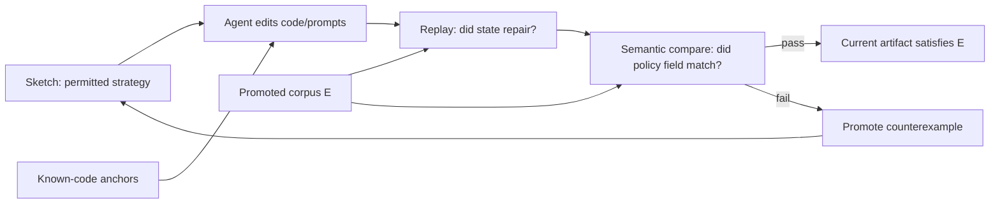

# Agentic Synthesis against Counterexample-Supplemented Sketches

**Paper:** [`paper/main.tex`](paper/main.tex)  
**Bibliography:** [`paper/references.bib`](paper/references.bib)  
**Companion artifact:** runnable examples, fixtures, and provenance for the paper's claims.

**Agentic synthesis against counterexample-supplemented sketches** makes coding-agent work checkable against a finite promoted corpus. A human writes a partial program-like sketch; failures become counterexamples; an agent edits code and prompts; replay/compare gates check the current artifact against the promoted cases.

The paper is the primary artifact. It names the method, gives the formal model, places the work against sketching, CEGIS, programming by example, tests-as-prompts, and coding-agent benchmarks, and states the finite-corpus correctness claim. This repository is companion evidence: runnable examples, fixtures, provenance, and tests for the paper's worked claims.

## Method at a glance



## Read by path

- **Academics:** start with [`paper/main.tex`](paper/main.tex), then inspect [`paper/references.bib`](paper/references.bib) and the executable evidence below. The claim boundary is finite-corpus soundness over the promoted corpus `E`.
- **Developers:** read the RosterSynth kiosk path, then run the commands in [Reproduce the paper artifact](#reproduce-the-paper-artifact). The examples show how to turn sketch clauses, failures, replay checks, and compare checks into an agent loop.

The RosterSynth kiosk material is the paper's worked example. It supports the method; the paper carries the claim.

## Originating setting

The method originated in a proprietary enterprise deployment for a heterogeneous data-cleansing pipeline operated by non-developers. That deployment used a custom Cursor extension, `cursor://`-style commands, an embedded SME web app, SME corrections converted with LLM assistance into input/output specs, a counterexample loop, and a promoted golden corpus for multiple downstream clients.

This public companion contains the publishable slice: the paper, clean fixtures, runnable examples, tests, and provenance. Production data, client-specific rules, proprietary extension code, and private SME workflows stay outside the repo.

## What this companion artifact supports

The paper's executable claim is bounded:

> If the replay/compare gate passes every case in the promoted counterexample corpus `E`, then the current agent-produced artifact is correct for `E` under the repository's executable replay and compare semantics.

The repository supports that claim with:

| Artifact | Paper role |
|---|---|
| `examples/rostersynth-kiosk/source/docs/sketch.md` | Concrete sketch clauses for the worked example |
| `examples/rostersynth-kiosk/source/scenarios/*.json` | Corpus `E` and promoted counterexamples |
| `examples/rostersynth-kiosk/source/rostersynth/playbook.py` | Oracle A deterministic implementation |
| `examples/rostersynth-kiosk/source/rostersynth/oracle/prompt.py` | Oracle B prompt path |
| `examples/rostersynth-kiosk/source/cassettes/*.json` | Reproducible Oracle B cassette fixtures |
| `examples/rostersynth-kiosk/tests/test_extracted_rostersynth.py` | Executable checks for the paper's worked-example claims |
| `build/rostersynth-kiosk-graph.json` | Source/provenance graph for appendix-style inspection |
| `.oh/knowledge/rostersynth-kiosk/` | Repo-native node files for the same graph |

## Worked example: RosterSynth kiosk

The paper uses one concrete case to show why replay and semantic compare are separate checks.

A roster has twin active 40-hour bookings on the pay-window end date. Badge hours are 40 and scheduled hours are 80, so a naive append of `-40h` closes the coverage math while violating duplicate policy. The correct repair cancels the duplicate booking with the higher `bookingId`.

The counterexample path is:

```text
roster.kiosk_double_booking.v1
→ sketch Op 2: cancel duplicate higher bookingId when it alone closes delta
→ historical failure: append -40h passes replay; compare rejects expected append vs modify
→ Oracle A: _try_cancel_duplicate emits modify bookingId=1802 status=4
→ Oracle B prompt/cassette path states the same rule
→ lower-booking cassette bookingId=1801 passes replay; compare catches wrong booking
→ gate passes after sketch/code/prompt alignment
```

That path is evidence for the paper's method.

## Reproduce the paper artifact

From the repo root:

```bash
python3 tools/extract_rostersynth_example.py --write --paper
python3 tools/extract_rostersynth_example.py --ce roster.kiosk_double_booking.v1
python3 -m unittest discover -s examples/rostersynth-kiosk/tests
```

Expected test result:

```text
Ran 6 tests
OK
```

The checks exercise the paper's worked-example obligations:

- Oracle A cancels higher duplicate `bookingId=1802`.
- Wrong append passes replay; compare rejects it.
- Lower-booking cassette cancels `1801`; compare rejects it.
- Hybrid keeps deterministic Oracle A on the kiosk case and avoids fallback.
- Oracle B prompt includes decision order, Op 2, higher-bookingId rule, and payload.
- Full corpus gates match deterministic, hybrid cassette, and llm-only cassette evidence.

## For developers

Use the companion artifact as an implementation appendix. The adaptable pattern is:

1. Put the intended strategy in a sketch file.
2. Add counterexamples for plausible wrong implementations.
3. Point the agent at known-code anchors before it writes new code.
4. Require a replay check for state repair.
5. Require a compare check for semantic fields replay under-specifies.
6. Promote every failure into the corpus and sketch before rerunning the agent.

A tiny didactic parser slice remains under [`examples/task-line-parser/`](examples/task-line-parser/) for readers who want the smallest version of the loop.

## For academics

Treat the repository as supplementary material for evaluating the paper's claims:

- [`paper/main.tex`](paper/main.tex) names and argues the method;
- the correctness result is finite-corpus soundness over the promoted corpus `E`;
- the RosterSynth kiosk case is the concrete witness;
- the tests and graph show how source artifacts back the paper's claims.

The relevant comparison points are program sketching, CEGIS, programming by example, tests-as-prompts, and coding-agent benchmarks.

## Repository map

```text
paper/
  main.tex                               # paper: process, references, formal model, correctness theorem
  references.bib                         # bibliography
  extracted-rostersynth-kiosk-paper.md   # generated evidence appendix
examples/
  rostersynth-kiosk/                     # worked example supporting the paper
    source/                              # copied RosterSynth source slice: sketch, scenarios, cassettes, code, tests
    tests/                               # self-contained checks for the paper's worked-example claims
  task-line-parser/                      # smallest didactic slice
flows/                                   # reusable agent flow prompts
.oh/knowledge/rostersynth-kiosk/         # repo-native graph node files
build/rostersynth-kiosk-graph.json       # extracted provenance graph
```

## Citation

> Castle, M. and Rubeck, E. *Agentic Synthesis against Counterexample-Supplemented Sketches.* 2026.

Private companion repo for now: `open-horizon-labs/sketch-counterexample-agent`.
