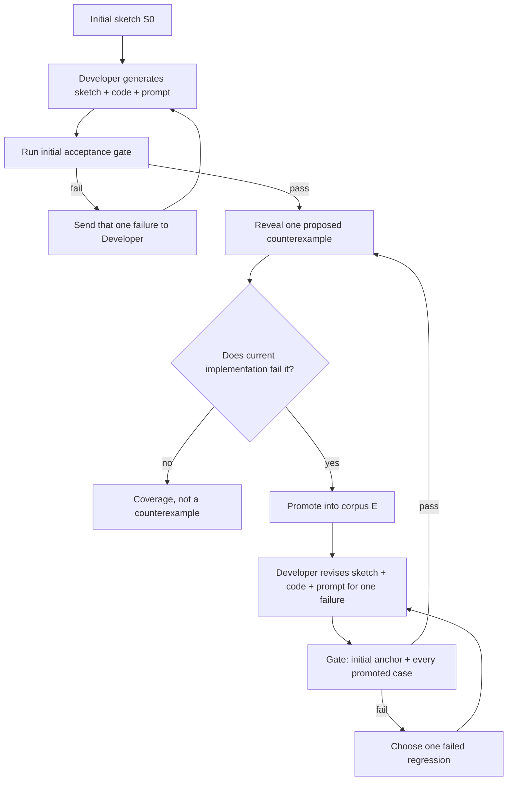

# Agentic Synthesis against Counterexample-Supplemented Sketches

This repository demonstrates a coding method for systems whose real specification is still
being discovered.

Start with a sketch of the strategy. Let a coding agent generate the implementation. Then reveal
one concrete case where that implementation is wrong. Give the agent the current sketch, current
code, and that one failure. After every revision, run the entire promoted corpus. A repair is done
only when the new case and every earlier case pass.

The sketch and implementation evolve together. The Developer may rewrite deterministic code,
the model prompt, and the sketch itself. It cannot memorize the unrevealed test set because it
never receives it.

CatSynth is the runnable example. It includes the teaching UI, the experiment harness, every
generated implementation and sketch, and an open-world comparison against two rebuild
strategies.

## The method

Let `S` be the current sketch, `E` the promoted counterexample corpus, `K` the repository's
known-code constraints, and `G` the regression gate.

1. Write an initial sketch `S0` that fixes the interface, the known strategy, and the holes that
   remain open.
2. Ask Developer to generate the initial sketch, deterministic implementation, and prompt
   implementation under `K`.
3. Run the initial acceptance gate. If it fails, give Developer that one failure and repeat.
4. Reveal one proposed counterexample. Run it against the current implementation before
   promotion. If it already passes, it is coverage, not a counterexample.
5. Promote a genuinely failing case into `E`.
6. Give Developer the current sketch, current code and prompt, and exactly one active failure.
   Developer may generalize the failure by changing both the sketch and implementation.
7. Run `G` over the initial anchor and all of `E`.
8. If a regression fails, make that failed case the next single active failure and return to
   step 6. Reveal no new counterexample until the full gate is green.
9. Repeat from step 4.

The Developer sees one active failure. The gate sees the whole promoted corpus.



This is the repository-scale adaptation of the CEGIS rhythm: generate, find a counterexample,
repair, and verify. The synthesizer is an ordinary coding model editing ordinary files, so the
claim is deliberately finite. A green gate establishes only that the current implementation
satisfies the current encoded checks for the current promoted corpus.

## Choose the frame before choosing the loop

There are two main situations:

- **Closed world:** the complete governing specification is available before implementation.
  Use spec-first generation and repair.
- **Open world:** important governing policy will be discovered only after an implementation
  encounters concrete failures. Use Sketch-CE to evolve the sketch and implementation together.

CatSynth captures both with the same `gpt-5.4-mini` model and low-effort controls. In the
closed-world run, spec-first reached 20/20 visible and 21/21 hidden cases with 4 Developer calls
and 611,519 model tokens through visible acceptance, including 132,632 Developer tokens and
478,887 Runtime Oracle tokens. That is the better approach when its premise is true.

[Read the closed-world spec-first run.](examples/catsynth/experiment/results/gpt-5.4-mini-spec-first-20260712/README.md)

The replay-all and evolved-sketch paths below are controls inside the open-world experiment.
They are not additional headline methodologies.

## What happened in the captured CatSynth run

The checked-in run used Codex App Server and `gpt-5.4-mini` at low effort, with no tools,
environment access, or model fallback. It froze 14 proposed cases before the run. Eight failed
the retained implementation and were promoted. Six already passed and were recorded as
coverage without being sent to Developer.

The experiment replayed that eight-case discovery stream through three paths:

- **Sketch-CE** retained its sketch, code, and prompt and repaired one active failure at a time.
- **Replay all** rebuilt from the initial sketch and every promoted case known at that epoch.
- **Evolved-sketch rebuild** rebuilt from the current Sketch-CE sketch. If the full gate failed,
  it received the visible failures from that gate, but never the full CE corpus.

| Measure | Replay all | Evolved-sketch rebuild | Sketch-CE |
|---|---:|---:|---:|
| **Tokens through visible acceptance** | **891,880** | **828,628** | **1,021,822** |
| Developer calls | 15 | 16 | 9 |
| Developer tokens | 400,081 | 371,050 | 217,576 |
| Runtime Oracle tokens through acceptance | 491,799 | 457,578 | 657,478 |
| Specification Oracle tokens | 0 | 0 | 146,768 |
| Post-acceptance evaluation tokens | 169,954 | 169,679 | 169,682 |
| Total recorded tokens, including evaluation | 1,061,834 | 998,307 | 1,191,504 |
| Extra repair attempts | 6 | 7 | 0 |
| First-attempt prior regressions | 2 | 7 | 0 |
| Artifact churn lines | 2,394 | 2,326 | 719 |
| Final strategy LOC | 224 | 228 | 298 |
| Final decision nodes | 77 | 70 | 110 |
| Final changed lines from baseline | 259 | 286 | 333 |
| Visible promoted cases | 8/8 | 8/8 | 8/8 |
| Hidden cases | 15/21 | 19/21 | 18/21 |

The first row is the cost to reach the visible acceptance gate: Developer calls that edit the
sketch, code, and prompt; Runtime Oracle calls that execute prompt-mediated policy while testing;
and Specification Oracle calls that propose general rules for promoted failures. Post-acceptance
visible and hidden evaluation is reported separately. Provider totals count input plus output;
cached input and reasoning are included subsets, not added again.

The candidate cases came from outside the system. Sketch-CE evaluated them against its current
implementation and proposed rules for the failures. The controls were handed the resulting
promotion schedule, so they did not pay to classify the candidates or propose those rules. Their
totals therefore have different accounting boundaries and are not a clean end-to-end price
ranking. Retaining the implementation reduced Developer work and churn; evolved-sketch rebuild
had the best hidden score. Sketch-CE's final strategy was also the largest and had the most
decision nodes, so low cumulative churn is evidence of less rework, not better final
maintainability. The result supports a narrow claim about implementation continuity, not
universal cost, correctness, or code-quality superiority.

Read the [experiment overview](examples/catsynth/experiment/results/gpt-5.4-mini-adaptive-open-world-v2-20260712/README.md)
or inspect the [complete compact results](examples/catsynth/experiment/results/gpt-5.4-mini-adaptive-open-world-v2-20260712/results.json).

## Inspect the actual synthesis history

The complete reviewable history is under
[`examples/catsynth/experiment/results/gpt-5.4-mini-adaptive-open-world-v2-20260712/`](examples/catsynth/experiment/results/gpt-5.4-mini-adaptive-open-world-v2-20260712/).

Each generation directory for each path contains the post-call state:

- `SKETCH.md` — the sketch Developer returned for that generation;
- `strategy.py` — the complete deterministic implementation;
- `oracle_prompt.txt` — the complete prompt implementation;
- `metadata.json` — the active failure, promoted corpus IDs, compact gate result, token usage,
  and diffs.

Raw transport transcripts remain local. The repository keeps the evolving artifacts and the
evidence needed to explain why each generation exists.

## Run the synthesis experiment

From `examples/catsynth` with Python 3 and the requirements installed:

```bash
uv run --with-requirements requirements.txt \
python experiment/adaptive_open_world_experiment.py \
  --model gpt-5.4-mini \
  --max-repairs 12
```

The Codex adapter speaks the App Server JSON-RPC protocol directly. It pins low effort,
disables tools and environment access, and prevents provider fallback.

An OpenAI-compatible Chat Completions endpoint is selectable instead:

```bash
CATSYNTH_LLM_API_KEY=local \
python3 experiment/run_experiment.py \
  --provider openai-compatible \
  --base-url http://127.0.0.1:8080/v1 \
  --model your-served-model
```

The endpoint must expose `GET /v1/models`, `POST /v1/chat/completions`, JSON-schema structured
output, and usage fields.

## Run the CatSynth teaching UI

The browser app presents the same method artifacts in a small synthetic domain. It is useful for
seeing the difference between state repair and policy preservation; the captured experiment is
the evidence that a coding model actually evolved the sketch and implementation.

```bash
cd examples/catsynth
python3 -m venv .venv
source .venv/bin/activate
python3 -m pip install -r requirements.txt
python3 cli.py seed --no-wiki
python3 cli.py serve
```

Open <http://127.0.0.1:8000>.

The focal UI case is an allergic owner who wants a large, fluffy, affectionate cat. A naive
preference-only strategy chooses Persian. Replay accepts that visible preference match, but
semantic compare rejects it because the promoted policy requires Siberian and the cited hard
rule `allergy_requires_hypoallergenic`.


CatSynth's breed attributes and policy rows are synthetic fixtures. They illustrate the control
loop; they are not pet-selection or medical advice.

The SQLite database is disposable runtime state. Delete `examples/catsynth/catsynth.db` and run
`python3 cli.py seed --no-wiki` to rebuild it from
[`seed.py`](examples/catsynth/catsynth/seed.py).

## Map the method to the repository

| Method term | CatSynth artifact |
|---|---|
| Initial sketch | [`experiment/initial_sketch.md`](examples/catsynth/experiment/initial_sketch.md) |
| Proposed counterexamples | [`experiment/cases.json`](examples/catsynth/experiment/cases.json) |
| Developer and gate loop | [`experiment/run_experiment.py`](examples/catsynth/experiment/run_experiment.py) |
| Codex App Server adapter | [`catsynth/codex_app_server.py`](examples/catsynth/catsynth/codex_app_server.py) |
| OpenAI-compatible adapter | [`catsynth/openai_compat.py`](examples/catsynth/catsynth/openai_compat.py) |
| Deterministic reference, Oracle A | [`catsynth/oracle_a.py`](examples/catsynth/catsynth/oracle_a.py) |
| Prompt-mediated runtime surface, Oracle B | [`catsynth/oracle_b.py`](examples/catsynth/catsynth/oracle_b.py) |
| Replay and semantic compare | [`catsynth/gate.py`](examples/catsynth/catsynth/gate.py) |
| Teaching UI | [`catsynth/app.py`](examples/catsynth/catsynth/app.py) and [`catsynth/static/`](examples/catsynth/catsynth/static/) |
| Adaptive comparison harness | [`experiment/adaptive_open_world_experiment.py`](examples/catsynth/experiment/adaptive_open_world_experiment.py) |
| Complete post-hoc generations | [`experiment/results/gpt-5.4-mini-adaptive-open-world-v2-20260712/`](examples/catsynth/experiment/results/gpt-5.4-mini-adaptive-open-world-v2-20260712/) |

Run all CatSynth tests with:

```bash
python3 -m unittest discover -s tests -v
```

## Claim boundary

A passing gate means the current strategy passes the repository's current replay and semantic
comparison predicates for the current promoted corpus. It does not establish correctness for
unseen cases, unencoded rules, incorrect golden outputs, buggy checkers, future model behavior,
or real cat-selection decisions.

The comparison adds another boundary: it is one run with one model and one reveal order. It
shows the mechanism and preserves the evidence needed to inspect it. Equal checked results do
not establish semantic equivalence outside the visible and hidden cases, and the token ratio does
not generalize to other models, adapters, or tasks.

## Read further

- [`paper/catsynth-worked-example.md`](paper/catsynth-worked-example.md) walks through the actual
  generations, the paired comparison, the UI, and the source artifacts.
- [`paper/main.pdf`](paper/main.pdf) presents the method, its lineage, the finite-corpus theorem,
  and the CatSynth example.
- [`paper/main.tex`](paper/main.tex) and [`paper/references.bib`](paper/references.bib) contain the
  paper source and bibliography.
- [`examples/task-line-parser/`](examples/task-line-parser/) is a smaller dependency-free sketch
  and counterexample exercise.
