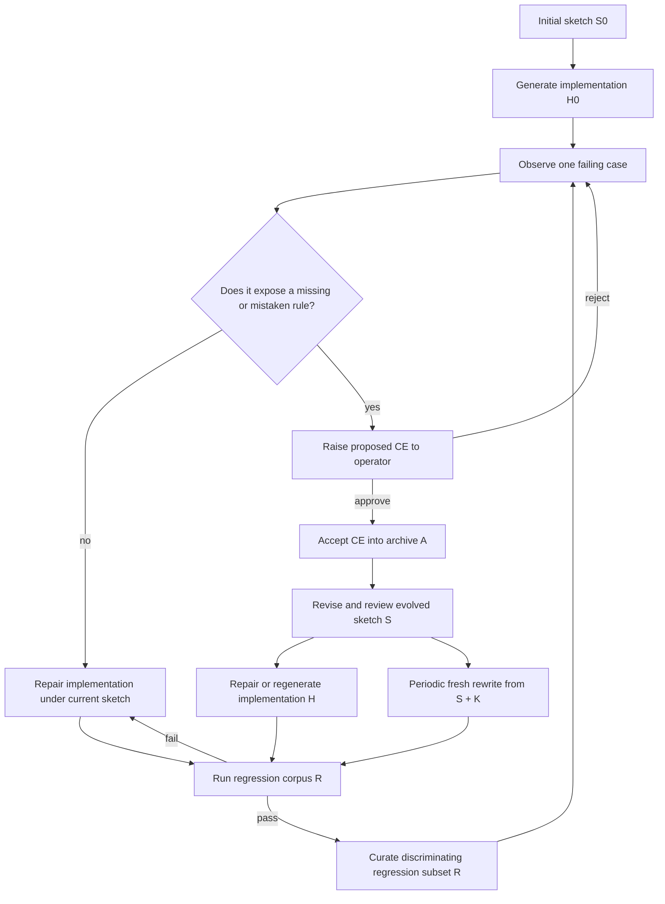

# Agentic Synthesis against Counterexample-Supplemented Sketches

Coding agents can fix a failing example without capturing the rule that made it fail. This
repository presents a method for carrying that rule into the next generation of code.

Start with a sketch: a partial statement of the strategy, interfaces, and known rules. An agent
generates the first implementation. When a concrete case fails, an operator decides which loop
it belongs to:

- If the sketch already states the right rule, repair the code.
- If the case exposes a missing or mistaken rule, the operator may approve it as a
  counterexample. Approval includes the corrected output and the policy change.

For each accepted counterexample, the agent revises the sketch and repairs or regenerates the
implementation. A regression gate checks the result against selected earlier cases before the
next case enters the loop.

The full counterexample archive records why the sketch changed. A curated regression set checks
later implementations against selected policy boundaries. The agent never receives either
collection as bulk prompt context: the evolved sketch carries the team's reviewed policy, and
the agent sees one active failure at a time. Code and prompts are disposable. Maintainers
periodically regenerate them from the sketch and repository constraints and require the result
to pass the same gate.

The method stands independently of its example. [CatSynth](examples/catsynth/README.md) is the
runnable supplement: a synthetic domain that shows the method in action from the initial sketch
through each approved counterexample, sketch revision, code repair, and regression gate. It also
includes every generated sketch and implementation, a teaching UI, and two rebuild controls that
help explain what the evolved sketch and retained code contribute.

## The method

The method keeps six roles separate:

| Symbol | Artifact | Job |
|---|---|---|
| `S` | Evolved sketch | Reviewed policy and known holes. |
| `A` | Accepted-counterexample archive | Complete record of approved corrections and sketch changes. |
| `R ⊆ A` | Regression corpus | Selected cases that protect distinct policy boundaries. |
| `K` | Repository anchors | Fixed interfaces, types, and known-code constraints. |
| `H` | Generated code and prompts | Replaceable implementation of the current sketch. |
| `G` | Regression gate | Runs the active case and `R`, then compares actual and approved outputs. |

`Developer` means the coding agent that edits the sketch, code, and prompt surfaces.

1. Write an initial sketch `S0` that states the interface, the known strategy, and the holes that
   remain open.
2. Give `S0` and `K` to Developer. Developer generates the first implementation `H0`.
3. Observe one concrete failure.
4. If `S` already states the right rule, treat the failure as an implementation error. Give that
   one failure to Developer and repair `H` without changing policy. Run `R` and repair any
   regression before observing another case.
5. If the failure contradicts or extends `S`, raise it to the operator. The operator reviews the
   case, corrected output, tempting wrong output, and missing rule. Only explicit approval turns
   the case into a counterexample.
6. Add the accepted counterexample to `A`.
7. Give Developer `S`, `H`, `K`, and that one active counterexample. Developer returns a revised
   sketch `S'` and any needed code or prompt changes. The operator checks the sketch revision
   against the approved correction.
8. Run the active counterexample and `R`. If a regression fails, return it as the next active
   failure and repair under the revised sketch. Do not reveal another case until the gate passes.
9. Add the active counterexample to `R` when it protects a policy boundary that selected cases do
   not already cover. Keep every accepted counterexample in `A`, even when `R` is smaller.
10. Periodically discard `H`, regenerate it from `S` and `K`, and run `G(R)`. If regeneration needs
    the archived examples as prompt context, the sketch has not captured the policy well enough.
    Then return to step 3.

The sketch carries the learned policy. The archive carries the evidence. The regression corpus
checks generated implementations. The code can be replaced.



The loop borrows CEGIS's generate-counterexample-revise-verify rhythm, but not its proof strength.
Here, a coding model edits source and prompt files, and the gate checks only encoded cases. A green
gate says that the current `H` passes `G(R)`. It says nothing about cases or rules outside that
gate.

## Use a complete specification when you have it

Choose the starting artifact based on what is known:

- **Closed world:** the complete governing specification exists before implementation. Generate
  from that specification and repair against its gate.
- **Open world:** failures will reveal important policy after implementation begins. Use
  Sketch-CE to evolve the sketch and implementation together.

CatSynth captures both with `gpt-5.4-mini` at low effort. In the closed-world run, Developer
received the complete immutable specification and empty files. One generation and three repairs
produced an implementation that passed all 21 gate cases. Post-acceptance evaluation passed 20/20
visible cases and 21/21 withheld cases. The run used 611,519 model tokens through acceptance and
851,448 including evaluation. Spec-first is the better choice when a complete specification
actually exists.

[Inspect the complete spec-first run.](examples/catsynth/experiment/results/gpt-5.4-mini-spec-first-20260712/README.md)

## Try the CatSynth teaching UI

The browser app makes the gate visible in a small synthetic domain. Its Review action records a
local operator decision in disposable SQLite state. It does not invoke Developer or edit the
repository sketch. The captured experiment, described below, contains the actual model-driven
sketch and code revisions.

```bash
cd examples/catsynth
python3 -m venv .venv
source .venv/bin/activate
python3 -m pip install -r requirements.txt
python3 cli.py seed --no-wiki
python3 cli.py serve
```

Open <http://127.0.0.1:8000>.

The focal case is an allergic owner who wants a large, fluffy, affectionate cat. A naive
preference-only strategy chooses Persian. Replay accepts that visible preference match. Semantic
compare rejects it because the approved synthetic policy requires Siberian and cites the hard
rule `allergy_requires_hypoallergenic`.


CatSynth's breed attributes and policy rows are synthetic fixtures. They illustrate the loop;
they are not pet-selection or medical advice.

The SQLite database is disposable. Delete `examples/catsynth/catsynth.db` and run
`python3 cli.py seed --no-wiki` from `examples/catsynth` to rebuild it from
[`seed.py`](examples/catsynth/catsynth/seed.py).

## What the captured open-world experiment tested

The checked-in run used Codex App Server and `gpt-5.4-mini` at low effort, with tools,
environment access, and model fallback disabled. Before the run, the harness froze 14 candidate
cases, corrected outputs, reviewer policies, and sketch clauses. When a candidate failed, those
frozen values supplied the simulated operator decision. The Specification Oracle proposed rule
wording, but the frozen reviewed output and sketch clause controlled promotion. The model could
not approve its own policy change.

Eight candidates failed the retained implementation and became accepted counterexamples. Six
already passed and were recorded as coverage without being sent to Developer. CatSynth uses all
eight accepted counterexamples as regressions, so `R = A` in this run. The method permits a
smaller curated `R`.

The harness replayed the same eight-case discovery schedule through three paths:

- **Replay-all** rebuilt from the initial sketch and every accepted counterexample known at that
  epoch.
- **Evolved-sketch rebuild** discarded the code and prompt at each epoch, then rebuilt from the
  current evolved sketch. Its first Developer call received no counterexample corpus. Failed gate
  cases could be returned for repair.
- **Sketch-CE with retained code** evolved the sketch after each accepted counterexample and kept
  the code and prompt between repairs.

The two rebuild paths are controls. They test what the evolved sketch carries and what retaining
generated code contributes; they are not additional recommended methodologies.

## What the run found

| Measure | Replay-all | Evolved-sketch rebuild | Sketch-CE (retained code) |
|---|---:|---:|---:|
| **All recorded model tokens, including evaluation** | **1,061,834** | **998,307** | **1,191,504** |
| Tokens through visible acceptance | 891,880 | 828,628 | 1,021,822 |
| Post-acceptance evaluation tokens | 169,954 | 169,679 | 169,682 |
| Developer calls | 15 | 16 | 9 |
| Developer tokens | 400,081 | 371,050 | 217,576 |
| Runtime Oracle tokens through acceptance | 491,799 | 457,578 | 657,478 |
| Specification Oracle tokens | 0 | 0 | 146,768 |
| Accepted CE evaluation | 8/8 | 8/8 | 8/8 |
| Withheld evaluation | 15/21 | 19/21 | 18/21 |
| Extra repair attempts | 6 | 7 | 0 |
| Prior regressions on first attempt | 2 | 7 | 0 |
| Artifact churn lines | 2,394 | 2,326 | 719 |
| Final strategy LOC | 224 | 228 | 298 |
| Final decision nodes | 77 | 70 | 110 |
| Final changed lines from baseline | 259 | 286 | 333 |

The first row is the broadest token total for each path. It includes every recorded Developer,
Runtime Oracle, Specification Oracle, and post-acceptance evaluation call in that path. Provider
totals count input plus output. Cached input and reasoning are subsets of those totals, not extra
tokens added on top.

The totals do not cover the same work. Sketch-CE with retained code paid to probe the candidate
stream and propose rules for failures. Both rebuild controls inherited the resulting promotion
schedule, and evolved-sketch rebuild also inherited the sketch checkpoints. Their totals
therefore omit discovery work that Sketch-CE includes. These are real usage totals, but they are
not end-to-end price alternatives. Withheld cases ran only after visible acceptance and were
never returned as repair input.

The run produced two findings:

- **On this run's withheld cases, the evolved sketch carried policy better than raw example
  replay.** Evolved-sketch rebuild passed 19/21, compared with 15/21 for Replay-all. It also used
  fewer tokens, produced fewer decision nodes, and required one more repair attempt than
  Replay-all. This is evidence for the hypothesis that reviewed policy synthesis can outperform
  repeated inference from the example archive.
- **Retaining code reduced Developer work and churn.** Sketch-CE with retained code used 9
  Developer calls, 217,576 Developer tokens, and 719 lines of cumulative artifact churn, with no
  extra repairs or prior regressions. Its broader all-model token total was the largest, and its
  final strategy had the most lines and decision nodes. That supports continuity and lower-rework
  claims, not better final maintainability.

One run with one model and one reveal order cannot establish a general performance advantage.

Read the [guided epoch-by-epoch walkthrough](paper/catsynth-worked-example.md)
([PDF](paper/catsynth-supplement.pdf)), or audit the
[checked-in capture](examples/catsynth/experiment/results/gpt-5.4-mini-adaptive-open-world-v2-20260712/).
The [results JSON](examples/catsynth/experiment/results/gpt-5.4-mini-adaptive-open-world-v2-20260712/results.json)
contains the machine-readable aggregate.

## Inspect every generation

The complete reviewable history is under
[`examples/catsynth/experiment/results/gpt-5.4-mini-adaptive-open-world-v2-20260712/`](examples/catsynth/experiment/results/gpt-5.4-mini-adaptive-open-world-v2-20260712/).

Each generation directory contains the complete post-call state:

- `SKETCH.md` — the sketch Developer returned for that generation;
- `strategy.py` — the complete deterministic implementation;
- `oracle_prompt.txt` — the complete prompt implementation;
- `metadata.json` — the active failure, accepted CE IDs, compact gate result, token usage,
  and diffs.

Raw transport transcripts are not checked in. The repository keeps each generated state and the
evidence needed to explain why it exists.

## Re-run the experiments

From `examples/catsynth` with Python 3 and the requirements installed:

### Three-path open-world run

```bash
uv run --with-requirements requirements.txt \
  python experiment/adaptive_open_world_experiment.py \
  --model gpt-5.4-mini \
  --max-repairs 12
```

This harness uses Codex App Server. The adapter pins low effort, disables tools and environment
access, and prevents model fallback.

### Closed-world spec-first run

```bash
uv run --with-requirements requirements.txt \
  python experiment/run_experiment.py \
  --provider codex-app-server \
  --model gpt-5.4-mini \
  --max-repairs 12 \
  --spec-first
```

### OpenAI-compatible API

The three-path adaptive harness currently uses Codex App Server. `run_experiment.py` supports an
OpenAI-compatible endpoint for spec-first and the paired Sketch-CE versus one-shot-with-repair
experiment. This command runs spec-first:

```bash
CATSYNTH_LLM_API_KEY=local \
uv run --with-requirements requirements.txt \
  python experiment/run_experiment.py \
  --provider openai-compatible \
  --base-url http://127.0.0.1:8080/v1 \
  --model your-served-model \
  --spec-first
```

The endpoint must expose `GET /v1/models`, `POST /v1/chat/completions`, JSON-schema structured
output, and usage fields.

## Where the method lives in the repository

| Method term | CatSynth artifact |
|---|---|
| Initial open-world sketch | [`experiment/initial_sketch.md`](examples/catsynth/experiment/initial_sketch.md) |
| Complete closed-world specification | [`experiment/complete_spec.md`](examples/catsynth/experiment/complete_spec.md) |
| Candidate pool, order, and promotion rule | [`experiment/adaptive_candidate_manifest.json`](examples/catsynth/experiment/adaptive_candidate_manifest.json) |
| Simulated operator references | [`experiment/cases.json`](examples/catsynth/experiment/cases.json) |
| Accepted CE archive and regression corpus (`R = A` in this run) | [`promoted-corpus.json`](examples/catsynth/experiment/results/gpt-5.4-mini-adaptive-open-world-v2-20260712/promoted-corpus.json) |
| Developer and gate loop | [`experiment/run_experiment.py`](examples/catsynth/experiment/run_experiment.py) |
| Three-path open-world harness | [`experiment/adaptive_open_world_experiment.py`](examples/catsynth/experiment/adaptive_open_world_experiment.py) |
| Codex App Server adapter | [`catsynth/codex_app_server.py`](examples/catsynth/catsynth/codex_app_server.py) |
| OpenAI-compatible adapter | [`catsynth/openai_compat.py`](examples/catsynth/catsynth/openai_compat.py) |
| Deterministic reference, Oracle A | [`catsynth/oracle_a.py`](examples/catsynth/catsynth/oracle_a.py) |
| Prompt-mediated runtime surface, Oracle B | [`catsynth/oracle_b.py`](examples/catsynth/catsynth/oracle_b.py) |
| Replay and semantic compare | [`catsynth/gate.py`](examples/catsynth/catsynth/gate.py) |
| Teaching UI | [`catsynth/app.py`](examples/catsynth/catsynth/app.py) and [`catsynth/static/`](examples/catsynth/catsynth/static/) |
| Every saved generation | [`experiment/results/gpt-5.4-mini-adaptive-open-world-v2-20260712/`](examples/catsynth/experiment/results/gpt-5.4-mini-adaptive-open-world-v2-20260712/) |

Run all CatSynth tests with:

```bash
cd examples/catsynth
uv run --with-requirements requirements.txt \
  python -m unittest discover -s tests -v
```

## Evidence limits

Each green gate says only that the current implementation passes the repository's current replay
and semantic checks for `R`. It does not establish correctness for unseen cases, unencoded rules,
wrong approved outputs, buggy checkers, future model behavior, or real cat-selection
decisions.

The experiment uses one model, one candidate order, and one captured run. The withheld scores
describe those 21 cases; they do not measure behavior beyond that suite. Equal visible results do
not establish semantic equivalence outside the checked cases. The token totals do not generalize
to other models, adapters, tasks, or accounting boundaries.

## Paper and supporting artifacts

- [`paper/main.pdf`](paper/main.pdf) is the canonical distributed paper. It contains the method,
  experimental design, results, and limitations, then appends the complete CatSynth supplement.
- [`paper/catsynth-supplement.pdf`](paper/catsynth-supplement.pdf) is the same CatSynth supplement
  as a standalone PDF for readers who want the concrete example without the paper.
- [`paper/main.tex`](paper/main.tex) and [`paper/references.bib`](paper/references.bib) contain the
  paper source and bibliography.
- [`paper/catsynth-worked-example.md`](paper/catsynth-worked-example.md) is the editable source for
  that supplement. It contains the full generation sequence, UI, source map, and artifact-level
  results. [`paper/README.md`](paper/README.md) explains how both PDFs are built and packaged for
  arXiv.
- [`examples/task-line-parser/`](examples/task-line-parser/) is a smaller dependency-free sketch
  and counterexample exercise.

## License

Repository material outside [`paper/`](paper/) is licensed under the
[MIT License](LICENSE). The papers, their source files, and original figures are licensed under
[CC BY 4.0](paper/LICENSE). Third-party material is excluded where identified.
