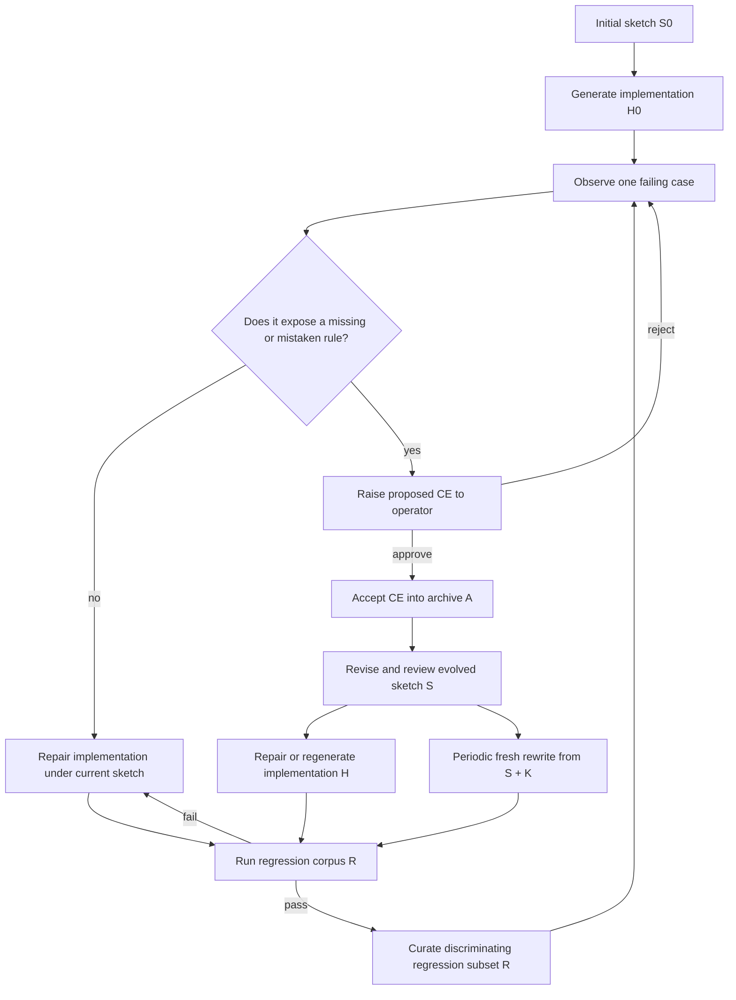

# Agentic Synthesis against Counterexample-Supplemented Sketches

Coding agents can fix a failing example without capturing the rule that made it fail. This
repository presents a method for carrying that rule into the next generation of code.

Start with a sketch: a partial statement of the strategy, interfaces, and known rules. An agent
generates the first implementation. When a concrete case fails, an operator decides which loop
it belongs to:

- If the sketch already states the right rule, repair the code.
- If the case exposes a missing or mistaken rule, the operator may approve it as a
  counterexample. Approval includes the corrected output and the policy change.

For each accepted counterexample, the agent revises the sketch and repairs or regenerates the
implementation. A regression gate checks the result against selected earlier cases before the
next case enters the loop.

The full counterexample archive records why the sketch changed. A curated regression set checks
later implementations against selected policy boundaries. The agent never receives either
collection as bulk prompt context: the evolved sketch carries the team's reviewed policy, and
the agent sees one active failure at a time. Code and prompts are disposable. Maintainers
periodically regenerate them from the sketch and repository constraints and require the result
to pass the same gate.

CatSynth makes the loop runnable and inspectable. It includes the application, the experiment
harness, every generated sketch and implementation, and comparisons with two rebuild controls.

## The method

Let `S` be the current evolved sketch, `A` the accepted-counterexample archive, `R ⊆ A` the
curated regression corpus, `K` the repository's known-code constraints, `H` the generated code
and prompts, and `G` the regression gate.

1. Write an initial sketch `S0` that fixes the interface, the known strategy, and the holes that
   remain open.
2. Ask Developer to generate an initial implementation `H0` from `S0` and `K`.
3. Observe one concrete failure. If the current sketch already states the correct rule, treat the
   failure as an implementation regression and repair `H` under `S`.
4. If the failure invalidates or extends the current sketch, raise it to the operator as a
   proposed counterexample. The operator reviews the case, corrected output, and missing rule.
   Nothing changes policy without explicit approval.
5. After approval, add the accepted counterexample to `A` with the corrected output, the
   tempting wrong output, and the rule that distinguishes them.
6. Give Developer `S`, `H`, `K`, and that one active counterexample. Developer must return a
   revised sketch `S'` as well as repaired code or prompts. The operator reviews the sketch change
   against the approved correction.
7. Run the active counterexample and the current regression corpus `R`. Repair any regression
   under the revised sketch before revealing another case.
8. Curate `R`: retain the active CE when its policy boundary is not already protected by the
   selected cases. The archive `A` remains complete even when `R` is smaller.
9. Periodically discard `H`, regenerate it from `S` and `K`, and run `G(R)`. If regeneration needs
   the archived examples as prompt context, the sketch has not captured the policy well enough.
10. Repeat from step 3.

The sketch carries the learned policy. The archive carries the evidence. The regression corpus
checks generated implementations. The code can be replaced.



This is the repository-scale adaptation of the CEGIS rhythm: generate, find a counterexample,
revise the governing sketch, regenerate or repair, and verify. The synthesizer is an ordinary
coding model editing ordinary files, so the claim is deliberately finite. A green gate establishes
only that the current implementation satisfies the current encoded checks in `R`.

## Choose the frame before choosing the loop

There are two main situations:

- **Closed world:** the complete governing specification is available before implementation.
  Use spec-first generation and repair.
- **Open world:** important governing policy will be discovered only after an implementation
  encounters concrete failures. Use Sketch-CE to evolve the sketch and implementation together.

CatSynth captures both with the same `gpt-5.4-mini` model and low-effort controls. In the
closed-world run, spec-first reached 20/20 visible and passed 21/21 withheld cases with 4 Developer calls
and 611,519 model tokens through visible acceptance, including 132,632 Developer tokens and
478,887 Runtime Oracle tokens. That is the better approach when its premise is true.

[Read the closed-world spec-first run.](examples/catsynth/experiment/results/gpt-5.4-mini-spec-first-20260712/README.md)

The open-world experiment separates two questions: whether the evolved sketch carries the
learned policy, and whether retaining generated code helps while that sketch evolves. Replay-all
and evolved-sketch rebuild are controls, not additional headline methodologies.

## What happened in the captured CatSynth run

The checked-in run used Codex App Server and `gpt-5.4-mini` at low effort, with no tools,
environment access, or model fallback. It froze 14 candidate cases and authoritative expected
outputs before the run, treating them as a simulated operator-approved discovery stream. It does
not give the model authority to approve policy. Eight cases failed the retained
implementation and were promoted. Six already passed and were recorded as coverage without
being sent to Developer.

CatSynth keeps the public run deliberately small. It uses every promoted counterexample as a
regression case, so `R = A` for this experiment. The method itself permits a smaller curated `R`.

The experiment replayed that eight-case discovery stream through three paths:

- **Sketch-CE** evolved the sketch for each accepted CE while retaining code and prompt between
  repairs.
- **Replay all** rebuilt from the initial sketch and every promoted case known at that epoch.
- **Evolved-sketch rebuild** discarded code and prompt, then rebuilt from the current evolved
  sketch alone. Its first Developer call received no CE corpus. The regression gate could return
  visible failures for repair.

| Measure | Replay all | Evolved-sketch rebuild | Sketch-CE |
|---|---:|---:|---:|
| **Tokens through visible acceptance** | **891,880** | **828,628** | **1,021,822** |
| Developer calls | 15 | 16 | 9 |
| Developer tokens | 400,081 | 371,050 | 217,576 |
| Runtime Oracle tokens through acceptance | 491,799 | 457,578 | 657,478 |
| Specification Oracle tokens | 0 | 0 | 146,768 |
| Post-acceptance evaluation tokens | 169,954 | 169,679 | 169,682 |
| Total recorded tokens, including evaluation | 1,061,834 | 998,307 | 1,191,504 |
| Extra repair attempts | 6 | 7 | 0 |
| First-attempt prior regressions | 2 | 7 | 0 |
| Artifact churn lines | 2,394 | 2,326 | 719 |
| Final strategy LOC | 224 | 228 | 298 |
| Final decision nodes | 77 | 70 | 110 |
| Final changed lines from baseline | 259 | 286 | 333 |
| Visible accepted CEs | 8/8 | 8/8 | 8/8 |
| Withheld cases | 15/21 | 19/21 | 18/21 |

The first row is the cost to reach the visible acceptance gate: Developer calls that edit the
sketch, code, and prompt; Runtime Oracle calls that execute prompt-mediated policy while testing;
and Specification Oracle calls that propose general rules for promoted failures. Post-acceptance
visible and withheld evaluation is reported separately. The withheld cases run only after visible
acceptance and are never returned as repair input. Provider totals count input plus output;
cached input and reasoning are included subsets, not added again.

The candidate cases came from outside the system. Sketch-CE paid to classify them and propose
sketch revisions. The controls inherited that promotion schedule, so the token totals have
different accounting boundaries and are not end-to-end price rankings.

The comparison still exposes the method's central mechanism. Replay-all asked the model to infer
policy again from the initial sketch and every accepted example. Evolved-sketch rebuild gave the
model only the reviewed synthesis of those examples. In this run, the evolved-sketch rebuild
passed 19/21 withheld cases versus 15/21 for replay-all, used fewer tokens through acceptance,
and ended with fewer decision nodes. It also required more repair turns and cumulative churn.
One run cannot establish a general advantage, but it supports the hypothesis that a reviewed
policy synthesis can generalize better than repeatedly replaying the raw example history.

Retaining the implementation reduced Developer work and churn, but Sketch-CE's final strategy was
the largest and had the most decision nodes. That result shows less rework during evolution, not
better final maintainability. The evolved sketch, CE archive, and regression gate are the durable
method artifacts; retaining code is an implementation choice.

Read the [experiment overview](examples/catsynth/experiment/results/gpt-5.4-mini-adaptive-open-world-v2-20260712/README.md)
or inspect the [complete compact results](examples/catsynth/experiment/results/gpt-5.4-mini-adaptive-open-world-v2-20260712/results.json).

## Inspect the actual synthesis history

The complete reviewable history is under
[`examples/catsynth/experiment/results/gpt-5.4-mini-adaptive-open-world-v2-20260712/`](examples/catsynth/experiment/results/gpt-5.4-mini-adaptive-open-world-v2-20260712/).

Each generation directory for each path contains the post-call state:

- `SKETCH.md` — the sketch Developer returned for that generation;
- `strategy.py` — the complete deterministic implementation;
- `oracle_prompt.txt` — the complete prompt implementation;
- `metadata.json` — the active failure, accepted CE IDs, compact gate result, token usage,
  and diffs.

Raw transport transcripts remain local. The repository keeps the evolving artifacts and the
evidence needed to explain why each generation exists.

## Run the synthesis experiment

From `examples/catsynth` with Python 3 and the requirements installed:

```bash
uv run --with-requirements requirements.txt \
python experiment/adaptive_open_world_experiment.py \
  --model gpt-5.4-mini \
  --max-repairs 12
```

The Codex adapter speaks the App Server JSON-RPC protocol directly. It pins low effort,
disables tools and environment access, and prevents provider fallback.

An OpenAI-compatible Chat Completions endpoint is selectable instead:

```bash
CATSYNTH_LLM_API_KEY=local \
python3 experiment/run_experiment.py \
  --provider openai-compatible \
  --base-url http://127.0.0.1:8080/v1 \
  --model your-served-model
```

The endpoint must expose `GET /v1/models`, `POST /v1/chat/completions`, JSON-schema structured
output, and usage fields.

## Run the CatSynth teaching UI

The browser app presents the same method artifacts in a small synthetic domain. It is useful for
seeing the difference between state repair and policy preservation; the captured experiment is
the evidence that a coding model actually evolved the sketch and implementation.

The browser's Review action records a local operator decision in disposable SQLite state. It
does not invoke Developer or edit the repository sketch; use the captured experiment to inspect
the complete accepted-CE-to-sketch-and-code loop.

```bash
cd examples/catsynth
python3 -m venv .venv
source .venv/bin/activate
python3 -m pip install -r requirements.txt
python3 cli.py seed --no-wiki
python3 cli.py serve
```

Open <http://127.0.0.1:8000>.

The focal UI case is an allergic owner who wants a large, fluffy, affectionate cat. A naive
preference-only strategy chooses Persian. Replay accepts that visible preference match, but
semantic compare rejects it because the approved policy requires Siberian and the cited hard
rule `allergy_requires_hypoallergenic`.


CatSynth's breed attributes and policy rows are synthetic fixtures. They illustrate the control
loop; they are not pet-selection or medical advice.

The SQLite database is disposable runtime state. Delete `examples/catsynth/catsynth.db` and run
`python3 cli.py seed --no-wiki` to rebuild it from
[`seed.py`](examples/catsynth/catsynth/seed.py).

## Map the method to the repository

| Method term | CatSynth artifact |
|---|---|
| Initial sketch | [`experiment/initial_sketch.md`](examples/catsynth/experiment/initial_sketch.md) |
| Proposed counterexamples | [`experiment/cases.json`](examples/catsynth/experiment/cases.json) |
| Simulated operator decisions | Frozen expected outputs and promotion criteria in [`experiment/cases.json`](examples/catsynth/experiment/cases.json) |
| Accepted CE archive | [`promoted-corpus.json`](examples/catsynth/experiment/results/gpt-5.4-mini-adaptive-open-world-v2-20260712/promoted-corpus.json) |
| Regression corpus (`R = A` in this run) | [`promoted-corpus.json`](examples/catsynth/experiment/results/gpt-5.4-mini-adaptive-open-world-v2-20260712/promoted-corpus.json) |
| Developer and gate loop | [`experiment/run_experiment.py`](examples/catsynth/experiment/run_experiment.py) |
| Codex App Server adapter | [`catsynth/codex_app_server.py`](examples/catsynth/catsynth/codex_app_server.py) |
| OpenAI-compatible adapter | [`catsynth/openai_compat.py`](examples/catsynth/catsynth/openai_compat.py) |
| Deterministic reference, Oracle A | [`catsynth/oracle_a.py`](examples/catsynth/catsynth/oracle_a.py) |
| Prompt-mediated runtime surface, Oracle B | [`catsynth/oracle_b.py`](examples/catsynth/catsynth/oracle_b.py) |
| Replay and semantic compare | [`catsynth/gate.py`](examples/catsynth/catsynth/gate.py) |
| Teaching UI | [`catsynth/app.py`](examples/catsynth/catsynth/app.py) and [`catsynth/static/`](examples/catsynth/catsynth/static/) |
| Adaptive comparison harness | [`experiment/adaptive_open_world_experiment.py`](examples/catsynth/experiment/adaptive_open_world_experiment.py) |
| Complete post-hoc generations | [`experiment/results/gpt-5.4-mini-adaptive-open-world-v2-20260712/`](examples/catsynth/experiment/results/gpt-5.4-mini-adaptive-open-world-v2-20260712/) |

Run all CatSynth tests with:

```bash
python3 -m unittest discover -s tests -v
```

## Claim boundary

A passing gate means the current strategy passes the repository's current replay and semantic
comparison predicates for the current regression corpus. It does not establish correctness for
unseen cases, unencoded rules, incorrect golden outputs, buggy checkers, future model behavior,
or real cat-selection decisions.

The comparison adds another boundary: it is one run with one model and one reveal order. It
shows the mechanism and preserves the evidence needed to inspect it. Equal checked results do
not establish semantic equivalence outside the regression and withheld cases, and the token ratio does
not generalize to other models, adapters, or tasks.

## Read further

- [`paper/main.pdf`](paper/main.pdf) is the self-contained paper: the method, its lineage, the
  finite-regression theorem, experimental design, results, limitations, and compact CatSynth
  example.
- [`paper/main.tex`](paper/main.tex) and [`paper/references.bib`](paper/references.bib) contain the
  paper source and bibliography.
- [`paper/catsynth-worked-example.md`](paper/catsynth-worked-example.md) is the optional audit and
  reproduction supplement. It contains the full generation sequence, UI, source map, and
  artifact-level results.
- [`examples/task-line-parser/`](examples/task-line-parser/) is a smaller dependency-free sketch
  and counterexample exercise.
