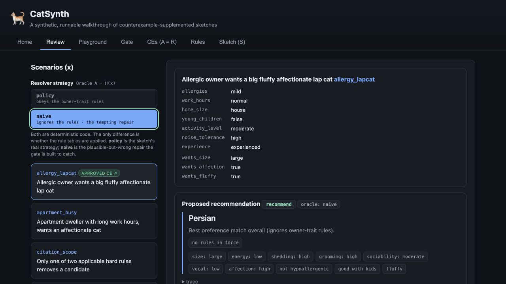
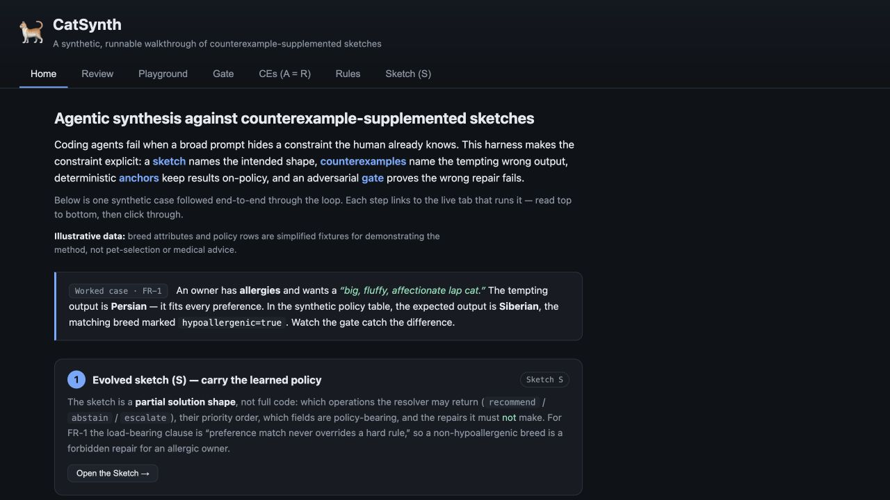
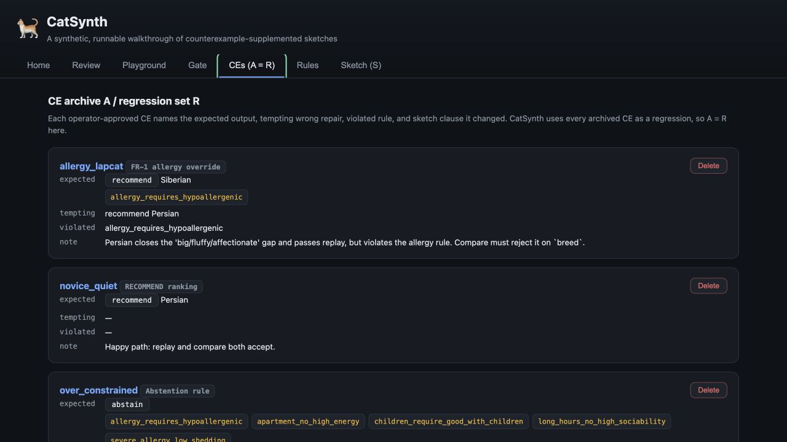
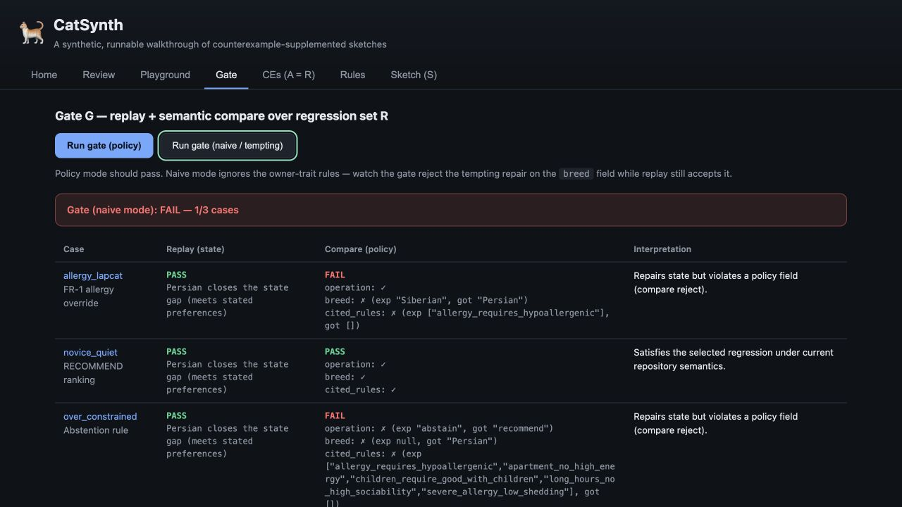

# CatSynth: The Full Sketch–Counterexample Run

This supplement shows how CatSynth implements the method in *Agentic Synthesis against
Counterexample-Supplemented Sketches*. The browser makes the artifacts visible. The experiment
harness actually asks a coding model to evolve the sketch, deterministic code, and model prompt
one counterexample at a time.

CatSynth uses synthetic breed attributes and policy rows selected to make the control loop easy
to inspect. Nothing here is pet-selection or medical advice.

## The method boundary

The method has four separate responsibilities:

- The **operator** decides whether a failing case is an authoritative counterexample to the
  current sketch.
- The **evolved sketch** carries the policy learned from every accepted counterexample.
- The **CE archive** preserves every approved case and explains why the sketch changed.
- The **regression set** checks selected consequences against generated code.

The code and prompt are replaceable. A clean implementation should be regenerable from the
evolved sketch and known-code anchors without replaying the CE archive as generation context.

CatSynth makes one simplifying choice: its run is small, so every accepted CE is also a
regression case (`R = A`). That is why its gate sees every promoted case. The general method does
not require the full archive to remain in the executable regression set.

The iterative arm also obeys one generation boundary:

> Developer sees one active failure. It never receives the CE archive or regression set as a
> bulk prompt.

The run starts from an initial sketch and empty `strategy.py` and `oracle_prompt.txt` files.
Developer returns complete replacements for all three evolving artifacts:

```text
SKETCH.md
strategy.py
oracle_prompt.txt
```

After the initial implementation passes its anchor, the harness reveals one proposed
counterexample. It evaluates the case before approval. A case that already passes is coverage,
not a counterexample; the harness records that result and continues to the next proposal without
sending it to Developer.

A failing case becomes a CE only if it exposes missing sketch policy and the operator approves
the corrected behavior. Developer then receives the current three files and that one failure. It
must revise the sketch with the code or prompt. The gate runs the active case and current
regressions. If an earlier case regresses, that failed regression becomes the next single
Developer input. The harness reveals no new case until the gate is green.

The captured run freezes candidate cases and authoritative expected outputs before execution,
then treats them as a simulated operator-approved stream. That makes the experiment
reproducible, but it simulates the live approval step rather than giving the model authority to
approve policy. Every accepted CE in the captured run changes `SKETCH.md`. The informational
restriction prevents Developer from copying future counterexamples into the sketch because it
never sees them.

## Reproduce the run

From `examples/catsynth`:

```bash
uv run --with-requirements requirements.txt \
python experiment/adaptive_open_world_experiment.py \
  --model gpt-5.4-mini \
  --max-repairs 12
```

The published run used GPT-5.4-mini with low effort. The adapter disabled tools and environment
access, disabled provider fallback, and used an ephemeral thread for every call. Raw JSON-RPC
transcripts stayed local; the repository retains every generated sketch, strategy, prompt,
failure, gate outcome, diff, and usage total.

The captured evidence is in
`examples/catsynth/experiment/results/gpt-5.4-mini-adaptive-open-world-v2-20260712/`.

## The starting point

The initial sketch fixes the public interface and the known preference ranking:

```python
recommend(profile, breeds, rules, oracle_tags)
```

It defines the ordinal maps and exact preference weights, but deliberately leaves two policy
surfaces open:

- rule rows exist, but the sketch does not yet say what matched rules do;
- `oracle_tags` exists, but no tag has a meaning yet.

That is the partial specification. It contains enough detail to generate and test an initial
strategy without preloading the later policy discoveries.

The clean-room baseline contains no implementation. Both rebuild controls copy the same empty
files at each discovery epoch.

## Generation 000: the initial strategy

Developer generates the first complete sketch, deterministic strategy, and narrative prompt
from the partial sketch and empty implementation files. The initial preference anchor passes:

```text
initial-preference-ranking: PASS
gate: 1/1
```

Only then does the harness reveal the first domain counterexample. The complete generation is
preserved under `arms/sketch-ce/generations/000-initial-generation/`.

## Generation 001: hard policy must filter before ranking

The first profile describes an owner with mild allergies who wants a large, fluffy,
affectionate cat. The current preference-only strategy returns Persian.

The approved counterexample requires:

```text
operation:    recommend
breed:        Siberian
cited_rules:  [allergy_requires_hypoallergenic]
```

The synthetic policy row says that mild or severe allergies activate a hard `forbid` rule for
breeds whose `hypoallergenic` field is false. The correction adds a general ordering rule:
filter hard-policy violations before ranking the survivors.

Developer receives only this failure and the current files. It revises the sketch and
`strategy.py` to interpret the rule row generically. CatSynth's `R = A` gate then passes the initial anchor
and CE1:

```text
initial-preference-ranking: PASS
ce-001-allergy-override:    PASS
gate: 2/2
```

The browser presents the same near miss as a teaching surface:



The point is the encoded ordering, not the cat claim. Persian closes the visible preference gap;
Siberian also closes it while satisfying the approved hard rule.

## Generation 002: hard rules compose and may force abstention

The second counterexample activates five hard rules: severe allergies, apartment constraints,
long work hours, and young children. The current implementation understands the first allergy
operator but still returns Balinese and cites only that rule.

The approved expectation is:

```text
operation: abstain
breed: null
cited_rules:
  - allergy_requires_hypoallergenic
  - apartment_no_high_energy
  - children_require_good_with_children
  - long_hours_no_high_sociability
  - severe_allergy_low_shedding
```

Developer generalizes again. The revised sketch and code support the additional profile and cat
predicate operators, apply every applicable hard rule, and abstain rather than relaxing policy
when no candidate remains.

The full regression passes:

```text
initial anchor: PASS
CE1:            PASS
CE2:            PASS
gate:           3/3
```

## Generation 003: the prompt learns a controlled tag

The third profile has no new structured policy row. Its missing information is in the narrative
note:

```text
I travel for work every few weeks and my last cat seemed miserable and lonely
whenever I was gone for days.
```

Before approval, the current prompt emits no tags and the deterministic strategy recommends
Balinese. CE3 adds one controlled narrative classification to the evolved sketch:

- travel, repeated absence, or concern about loneliness maps to exactly `avoid_needy`;
- the prompt classifies only the supplied note and may not invent unrelated tags;
- the deterministic meaning of `avoid_needy` remains an open hole.

This case compares only `oracle_tags`. Developer revises the prompt and sketch. The gate
passes 4/4 even though the strategy still chooses Balinese, because CE3 has not yet added a
deterministic meaning for the tag.

```text
initial anchor: PASS
CE1:            PASS
CE2:            PASS
CE3 tags:       PASS
gate:           4/4
```

## Generation 004: a new counterexample closes the deterministic hole

After CE3, the prompt emits `avoid_needy`, but the strategy still recommends Balinese. The
harness evaluates the next proposed case before approval. It fails on the breed field, so CE4
is a genuine new counterexample rather than another explanation pasted into CE3.

CE4 adds two connected rules:

- `avoid_needy` applies a one-point soft penalty to breeds with high sociability;
- base preference scoring continues to use only `wants_size`, `wants_affection`, and
  `wants_fluffy`. Default `activity_level`, `noise_tolerance`, and `experience` values do not add
  score unless an approved sketch clause gives them semantics.

Developer revises the sketch and deterministic code. The prompt remains green. The gate
passes 5/5:

```text
initial anchor: PASS
CE1:            PASS
CE2:            PASS
CE3 tags:       PASS
CE4 ranking:    PASS
gate:           5/5
```

The final retained Sketch-CE implementation passes 18/21 withheld cases. It misses two multi-tag
cases because no accepted discovery has yet defined `avoid_vocal`, and it misses one normalized
severe-allergy variant. Those failures show where another open-world counterexample could extend
the current sketch.

## What each generation archive proves

Every generation directory under `arms/` contains:

| File | Evidence |
|---|---|
| `SKETCH.md` | Developer's complete revised strategy |
| `strategy.py` | Complete deterministic implementation |
| `oracle_prompt.txt` | Complete prompt implementation |
| `metadata.json` | Active failure or failures, accepted CE IDs, compact gate outcome, usage, and diffs |

The Sketch-CE repair metadata identifies one active failure and no unrevealed case. The rebuild
controls preserve each generated state and the visible failures returned after a failed gate.
A reader can therefore inspect the information boundary and code evolution directly.

## The open-world comparison

The conceptual contrast remains spec-first versus Sketch-CE: a complete specification works when
the problem is already known, while Sketch-CE changes the governing sketch as the world reveals
new policy. The captured open-world experiment adds two controls to identify what carries that
policy forward.

- **Replay all** rebuilds from the initial sketch and every accepted case known at the current
  discovery epoch. It asks the model to infer policy again from raw examples.
- **Evolved-sketch rebuild** discards code and prompt, then receives only the current evolved
  sketch and known-code anchors. If its gate fails, it receives one visible failure at a time.
  This is the method's clean-regeneration test.
- **Sketch-CE** keeps the current sketch, code, and prompt and repairs each newly accepted case.

| Measure | Replay all | Evolved-sketch rebuild | Sketch-CE |
|---|---:|---:|---:|
| **Tokens through visible acceptance** | **891,880** | **828,628** | **1,021,822** |
| Developer calls | 15 | 16 | 9 |
| Developer tokens | 400,081 | 371,050 | 217,576 |
| Runtime Oracle tokens through acceptance | 491,799 | 457,578 | 657,478 |
| Specification Oracle tokens | 0 | 0 | 146,768 |
| Post-acceptance evaluation tokens | 169,954 | 169,679 | 169,682 |
| Total recorded tokens, including evaluation | 1,061,834 | 998,307 | 1,191,504 |
| Extra repair attempts | 6 | 7 | 0 |
| Artifact churn lines | 2,394 | 2,326 | 719 |
| Final strategy LOC | 224 | 228 | 298 |
| Final decision nodes | 77 | 70 | 110 |
| Visible accepted CEs | 8/8 | 8/8 | 8/8 |
| Withheld cases | 15/21 | 19/21 | 18/21 |

Tokens through acceptance include Developer edits, prompt-mediated Runtime Oracle checks, and
Specification Oracle rule proposals. The final visible and withheld evaluation is reported
separately. The candidate cases were external inputs. Sketch-CE paid to classify them and propose
general rules for the failures; the controls inherited the resulting promotion schedule without
paying for candidate classification or rule proposal. The totals therefore have different
boundaries and are not end-to-end price rankings. Retained Sketch-CE used less Developer work
and produced less churn. Evolved-sketch rebuild passed 19/21 withheld cases versus 15/21
for replay all. In this run, the evolved synthesis of the accepted examples generalized better
than asking the same model to re-infer policy from all examples at every epoch. Sketch-CE's final
strategy was the largest and had the most decision nodes, so the retained path shows less rework
during evolution, not better final maintainability.

This is one model, one candidate order, and one sample per path. It supports the hypothesis that
reviewed policy synthesis can carry lessons better than raw example replay. It does not establish
universal cost, correctness, or maintainability superiority.

## How the UI illustrates the finished artifacts

The experiment is the synthesis history. The browser is the finished inspection surface.

```bash
cd examples/catsynth
python3 cli.py seed --no-wiki
python3 cli.py serve
```

Open <http://127.0.0.1:8000>.



The UI exposes the stable repository artifacts:

1. **Sketch** — the strategy, policy order, holes, and abstention behavior.
2. **CE archive / regression set** — approved expected outputs, tempting outputs, violated rules,
   and sketch links. CatSynth shows the same cases in both roles because `R = A`.
3. **Oracle A** — deterministic hard-rule filtering, ranking, and abstention.
4. **Oracle B** — prompt-mediated narrative tags constrained to a controlled vocabulary.
5. **Gate** — replay and semantic comparison over CatSynth's regression set.

The browser's Review button records only a local operator decision in SQLite. It does not invoke
Developer or revise `SKETCH.md`. The experiment history, not that button, is the evidence for the
complete CE-to-sketch-and-code loop.

The CE archive / regression page keeps both sides of the focal correction:



An expected output records what should happen. The tempting output and violated rule record why a
plausible alternative must continue to fail.

## Why replay and semantic compare stay separate

Replay asks whether the candidate closes the visible state gap. For the focal recommendation, it
checks the encoded size, affection, and fluffiness preferences. It deliberately does not decide
the hard allergy policy.

Semantic compare checks the approved policy-bearing fields:

```text
operation
breed
cited_rules
```

The naive Persian result can therefore pass replay and fail semantic compare:



The split makes the failure actionable. The candidate repaired the visible preference state but
did not follow the approved policy.

## Source map

| Paper concept | Repository artifact |
|---|---|
| Initial sketch | `examples/catsynth/experiment/initial_sketch.md` |
| Counterexample reveal schedule | `examples/catsynth/experiment/cases.json` |
| Accepted CE archive | `examples/catsynth/experiment/results/gpt-5.4-mini-adaptive-open-world-v2-20260712/promoted-corpus.json` |
| Regression set (`R = A`) | `examples/catsynth/experiment/results/gpt-5.4-mini-adaptive-open-world-v2-20260712/promoted-corpus.json` |
| Developer/Oracle/gate orchestration | `examples/catsynth/experiment/run_experiment.py` |
| Codex App Server adapter | `examples/catsynth/catsynth/codex_app_server.py` |
| OpenAI-compatible adapter | `examples/catsynth/catsynth/openai_compat.py` |
| Reference Oracle A | `examples/catsynth/catsynth/oracle_a.py` |
| Runtime Oracle B | `examples/catsynth/catsynth/oracle_b.py` |
| UI archive / regression fixtures | `examples/catsynth/catsynth/seed.py` |
| UI replay and compare | `examples/catsynth/catsynth/gate.py` |
| Browser inspection surface | `examples/catsynth/catsynth/app.py` and `static/` |
| Adaptive comparison harness | `examples/catsynth/experiment/adaptive_open_world_experiment.py` |
| Captured generations and results | `examples/catsynth/experiment/results/gpt-5.4-mini-adaptive-open-world-v2-20260712/` |

## Claim boundary

The successful iterative gate establishes finite-regression correctness relative to these
fixtures, expected outputs, and evaluator code. The withheld cases add limited evidence of
generalization.
Neither result establishes correctness for all owner profiles, real breed facts, incorrect golden
rows, buggy checkers, unencoded policy, future model behavior, or other models and reveal orders.

That boundary is part of the method. CatSynth preserves enough evidence for a reader to see where
the claim begins and where it stops.
